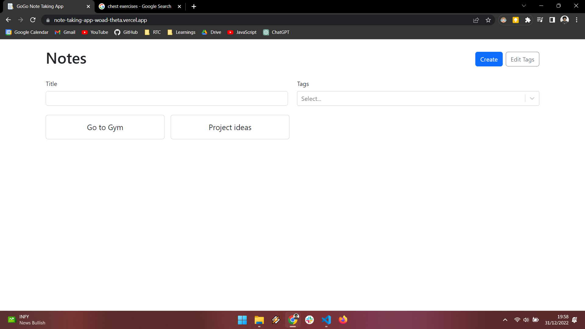
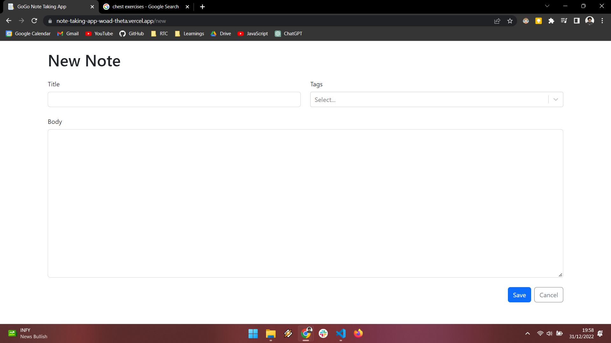
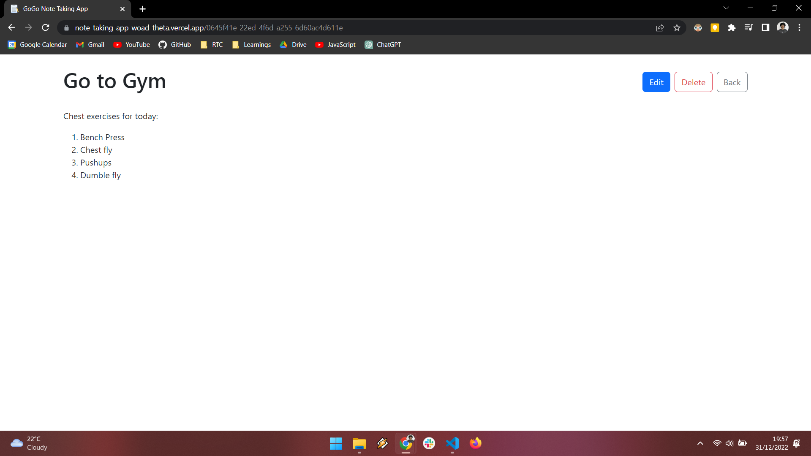
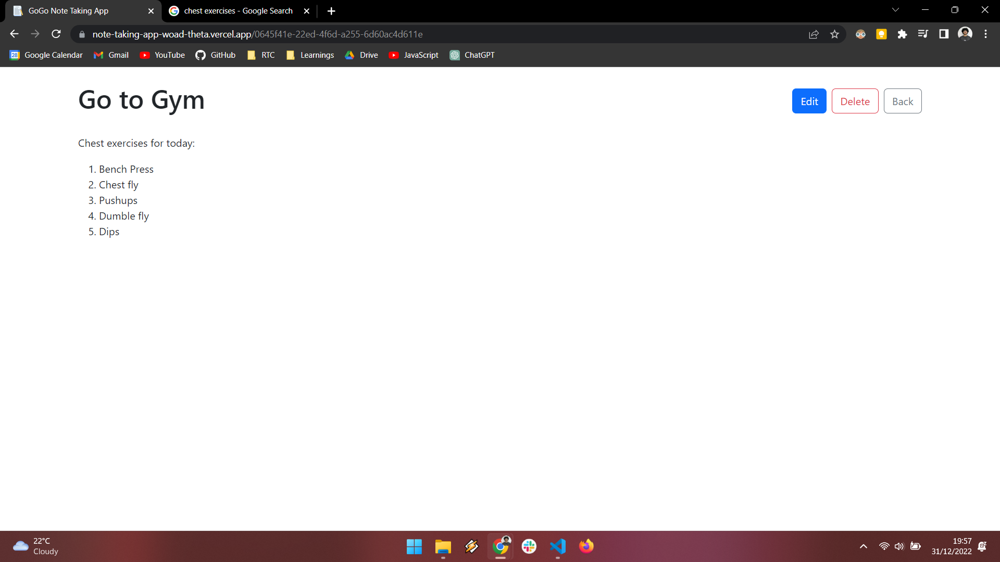

# Note-Taking-App

This is a note taking app built using Vite + React + TS. It uses the browser's local storage to store the notes. It has a search feature to search for notes. It allows you to create, edit, delete and search for notes and tags.
### 1. View the notes with their title. Click on a note to view it.
   

### 2. Create a note:

   ### 3. You can edit the note by clicking on the edit button. You can also delete the note by clicking on the delete button.

### 4. Search for a note:

