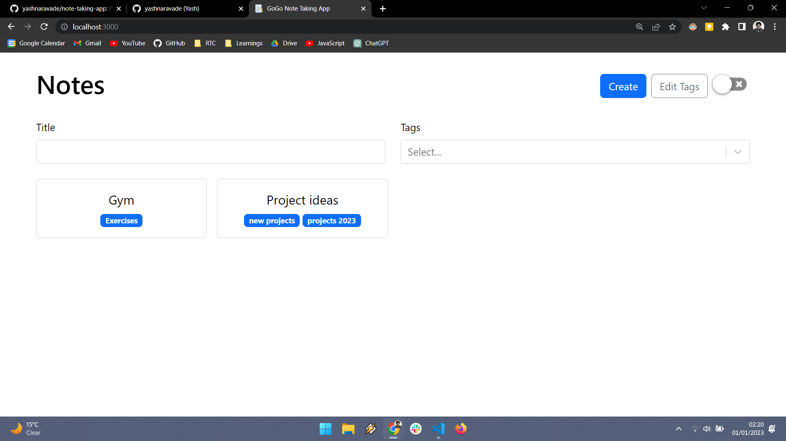
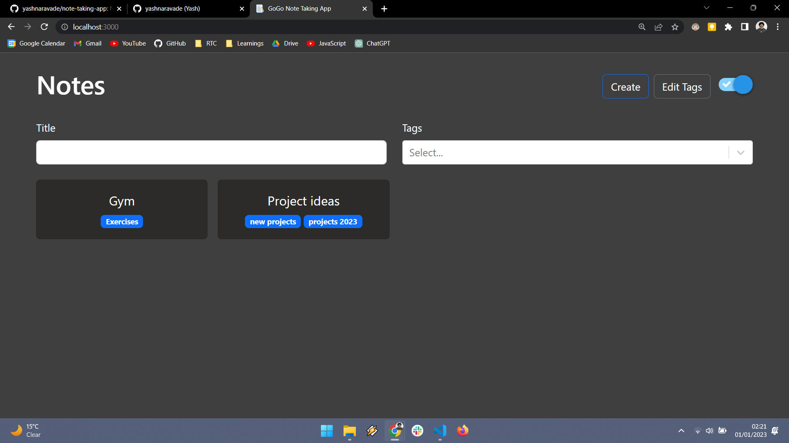

# Note-Taking-App

This is a note taking app built using Vite + React + TS. It uses the browser's local storage to store the notes. It has a search feature to search for notes. It allows you to create, edit, delete and search for notes and tags. It also allows you to add tags to notes. It also allows you to search for notes by tags or by title. It has a dark mode and a light mode toggle.
### 1. View the notes with their title. Click on a note to view it.
   

   ### 2. Dark mode:
   

### 2. Create a note:

   ### 3. You can edit the note by clicking on the edit button. You can also delete the note by clicking on the delete button.

### 4. Search for a note:

